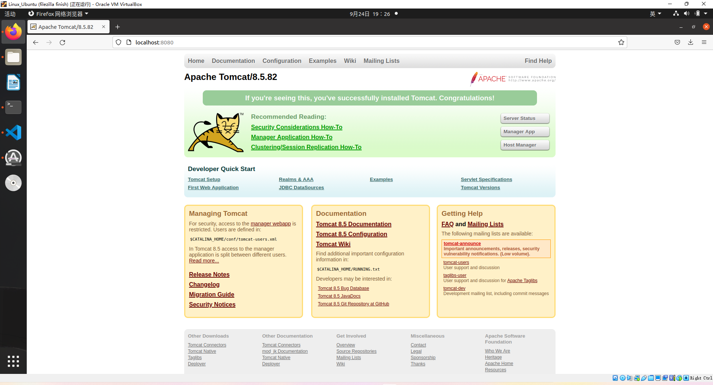

#### 姓名：赵子毅

#### 学号：PB20051107

#### 个人主页网址：[Kimagure 个人主页 (ustc.edu.cn)](http://home.ustc.edu.cn/~re2477036/)

ctrl+鼠标左键点击即可跳转

http://home.ustc.edu.cn/~re2477036/

#### Tomcat：

##### 主页截图：

##### 静态网页部署：

##### 动态网页部署：

本次实验我并未完成该选做内容。但是值得一提的是在上学期的OSH课程中，我曾与其他四名组员（组名x-TOBEDONE，其他组员：关浩祥，牛午甲，徐奥，谭俊飞）完成一个包含了动态网页部署的大作业，先将部分内容展示如下：

[OSH-2022/x-TOBEDONE: team TOBEDONE in USTC-OSH-2022 (github.com)](https://github.com/OSH-2022/x-TOBEDONE)

是不是觉得这个模板很眼熟…是的这与我静态网页使用的是同一个模板，当时大作业的网页美化我也有参与其中…