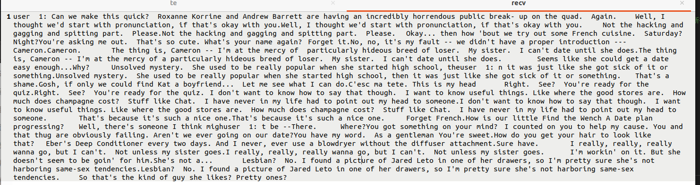

## 实验报告

### 实验内容

高级聊天程序：   一个服务器，多个客户端，服务器负责消息中转，客户端之间可以互相聊天。（广播）

### 实验平台和语言：

Ubuntu20.04 cpp

### 实验过程：

#### 主要变量：

1. `struct USER`,id即为用户身份标识，fd_recv是用户端的套接字，用于表示客户端，`client`作用等同于`user->fd_recv`
2. `mutex`，互斥锁，防止出现饥饿或死锁等问题
3. `msg_queue[MAX_USERS]`，消息队列，每个用户独享一个消息队列，客户的消息会被保存到这里，服务器会周期性地从这里提取消息并广播
4. `used[MAX_USERS]`标记哪个id是否在使用，分配时寻找未被使用的id

#### 算法思路：

服务器端通过socket编程监听指定的端口，对申请连接到该端口的客户端进行记录。随后，利用多线程技术为客户端创建一个专属线程，专用于负责从客户端接受消息，将该消息保存到主程序的消息队列。主程序同时新建一个线程用于从消息队列中提取消息并广播。对于n个用户，一共有n+2个线程在运行，n个用户线程，一个消息发送线程，一个服务器监听端口线程。

#### main：

首先调用socket创建socket句柄赋值给 `fd`,随后创建 `sockaddr_in`为 `fd`分配本地地址，随后使用listen监听连接，创建子线程用于消息发送，然后进入监听循环。每次循环，程序从fd中accept一个连接，随后分配id，记录其socket，创建线程为其服务。

#### msg_push:

每次循环从终端接受一定量的字节，随后malloc分配空间放到，将指针放到消息队列里。当len=0说明连接断开，<0表示出现异常，此时修改消息，关闭该客户端即可。在push队列的时候使用互斥锁。

#### msg_pop：

每次循环，遍历所有的在线的客户端，不断地提取其消息队列中的信息，随后通过send方法广播到其他在线客户端。在send的时候注意利用send函数返回值为成功发送的字节数，使用while循环不断send防止出现send没有发送完全的情况，并且在消息头加上用户标识，以换行符为分割发送每一条消息，例如，客户端向服务器发送了 `Hi.\nIt's Cindy here.`，在其他连接到服务器的 客户端中会收到这样的消息：

```text
Message: Hi.
Message: It's Cindy here.
```

#### 操作过程：

使用如下命令编译服务器端并运行，port为端口号（0-65535）

```
g++ server.cpp -o server -lpthread
./server port
```

对于客户端，使用Linux的终端，在终端中输入如下命令：

```
nc 127.0.0.1 port
```

如果想开多个客户端，只需要开启多个终端输入上述命令即可:

### 实验结果展示：


左上角的几个符号是由于终端变成了stty -raw后我不小心按到方向键出现的，不影响实验结果。

对于没有换行符的超长句子，使用重定向输入：


源文件：


收到的文件：



可见，除了由于多次发送出现的多个消息头，所有消息均全部送达。由于多个消息头的处理比较麻烦，本实验并未完成。