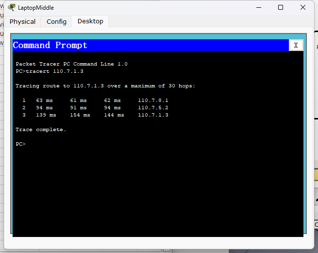

### 必做：

#### 子网划分

| 校区      | 子网         |
| --------- | ------------ |
| 南区      | 110.7.0.0/24 |
| 东区      | 110.7.1.0/24 |
| 北区      | 110.7.2.0/24 |
| 西区      | 110.7.3.0/24 |
| 中区      | 110.7.8.0/24 |
| 中区-南区 | 110.7.4.0/24 |
| 中区-东区 | 110.7.5.0/24 |
| 中区-北区 | 110.7.6.0/24 |
| 中区-西区 | 110.7.7.0/24 |

#### 接口Ip划分：

| Device        | Interface       | IP Address | Mask          | To Device     | To Interface    |
| ------------- | --------------- | ---------- | ------------- | ------------- | --------------- |
| Router Middle | FastEthernet0/0 | 110.7.4.1  | 255.255.255.0 | Router South  | FastEthernet0/0 |
|               | FastEthernet0/1 | 110.7.5.1  | 255.255.255.0 | Router East   | FastEthernet0/0 |
|               | FastEthernet1/0 | 110.7.6.1  | 255.255.255.0 | Router North  | FastEthernet0/0 |
|               | FastEthernet1/1 | 110.7.7.1  | 255.255.255.0 | Router West   | FastEthernet0/0 |
|               | Ethernet1/0/0   | 110.7.8.1  | 255.255.255.0 | Switch Middle |                 |
| Router South  | FastEthernet0/0 | 110.7.4.2  | 255.255.255.0 | Router Middle | FastEthernet0/0 |
|               | FastEthernet0/1 | 110.7.0.1  | 255.255.255.0 | Switch South  |                 |
| Router East   | FastEthernet0/0 | 110.7.5.2  | 255.255.255.0 | Router Middle | FastEthernet0/1 |
|               | FastEthernet0/1 | 110.7.1.1  | 255.255.255.0 | Switch East   |                 |
| Router North  | FastEthernet0/0 | 110.7.6.2  | 255.255.255.0 | Router Middle | FastEthernet1/0 |
|               | FastEthernet0/1 | 110.7.2.1  | 255.255.255.0 | Switch North  |                 |
| Router West   | FastEthernet0/0 | 110.7.7.2  | 255.255.255.0 | Router Middle | FastEthernet1/1 |
|               | FastEthernet0/1 | 110.7.3.1  | 255.255.255.0 | Switch West   |                 |

| Device          | IP Address | Mask          | Gateway   |
| --------------- | ---------- | ------------- | --------- |
| PC South        | 110.7.0.2  | 255.255.255.0 | 110.7.0.1 |
| Sever East      | 110.7.1.2  | 255.255.255.0 | 110.7.1.1 |
| PC East         | 110.7.1.3  | 255.255.255.0 | 110.7.1.1 |
| PC North        | 110.7.2.2  | 255.255.255.0 | 110.7.2.1 |
| Laptop West Lib | 110.7.3.2  | 255.255.255.0 | 110.7.3.1 |
| Laptop Middle   | 110.7.8.2  | 255.255.255.0 | 110.7.8.1 |

#### 搭建结果：

#### 静态路由：

仅使用指令展示其中两个路由器的结果，其他结果整合在excel表格中

其他结果：

| Router        | Network   | Mask          | Next Hop  |
| ------------- | --------- | ------------- | --------- |
| Router Middle | 110.7.0.0 | 255.255.255.0 | 110.7.4.2 |
|               | 110.7.1.0 | 255.255.255.0 | 110.7.5.2 |
|               | 110.7.2.0 | 255.255.255.0 | 110.7.6.2 |
|               | 110.7.3.0 | 255.255.255.0 | 110.7.7.2 |
|               | 110.7.8.0 | 255.255.255.0 | 110.7.8.2 |
| Router South  | 110.7.1.0 | 255.255.255.0 | 110.7.4.1 |
|               | 110.7.2.0 | 255.255.255.0 | 110.7.4.1 |
|               | 110.7.3.0 | 255.255.255.0 | 110.7.4.1 |
|               | 110.7.8.0 | 255.255.255.0 | 110.7.4.1 |
| Router East   | 110.7.0.0 | 255.255.255.0 | 110.7.5.1 |
|               | 110.7.2.0 | 255.255.255.0 | 110.7.5.1 |
|               | 110.7.3.0 | 255.255.255.0 | 110.7.5.1 |
|               | 110.7.8.0 | 255.255.255.0 | 110.7.5.1 |
| Router North  | 110.7.0.0 | 255.255.255.0 | 110.7.6.1 |
|               | 110.7.1.0 | 255.255.255.0 | 110.7.6.1 |
|               | 110.7.3.0 | 255.255.255.0 | 110.7.6.1 |
|               | 110.7.8.0 | 255.255.255.0 | 110.7.6.1 |
| Router West   | 110.7.0.0 | 255.255.255.0 | 110.7.7.1 |
|               | 110.7.1.0 | 255.255.255.0 | 110.7.7.1 |
|               | 110.7.2.0 | 255.255.255.0 | 110.7.7.1 |
|               | 110.7.8.0 | 255.255.255.0 | 110.7.7.1 |

#### 静态路由下连通性测试：

采用环路测试，每个终端ping逆时针顺序的下一个终端（东区有两台设备，任选其一）

1. 北到西

2. 东到北

3. 中到东

4. 南到中

5. 西到南

#### RIP：

##### 路由转发表信息：

1. 中

2. 北

3. 东

4. 南

5. 西

##### 路由protocol信息：

1. 中

2. 北

3. 东

4. 南

5. 西

##### 连通性测试：

1. 南到中

2. 西到南

3. 北到西

4. 东到北

5. 中到东

