## 计网lab4实验报告 PB20051107

### 配置主机与交换机：

#### 初始状态

拓扑网络如图：

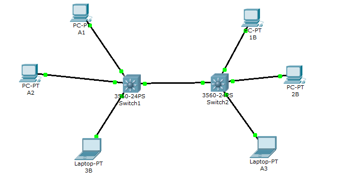

初始状态下，在3B输入`ping -n 1 255.255.255.255`，可收到其他所有主机的reply。原因为初始状态下所有设备同属于同一个VLAN：1，即default。它们属于同一个广播域。

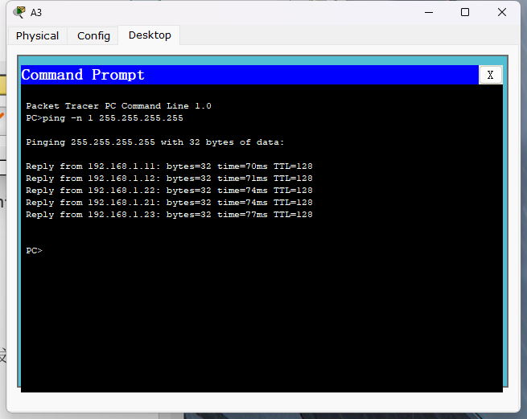

#### VLAN配置：

##### switch1：

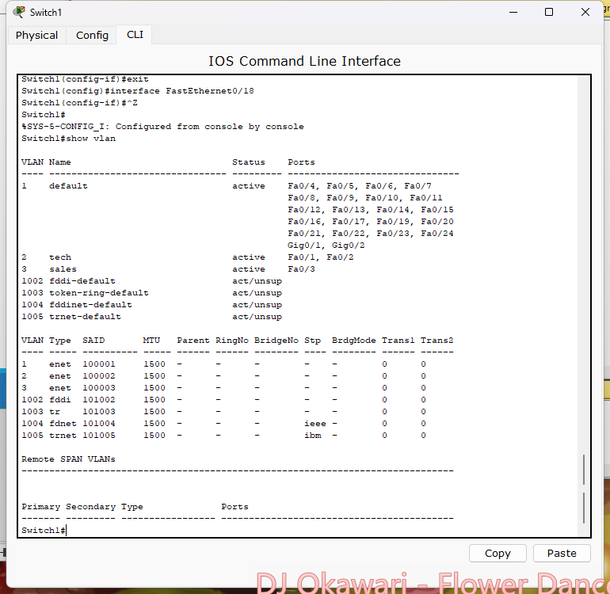

端口1：

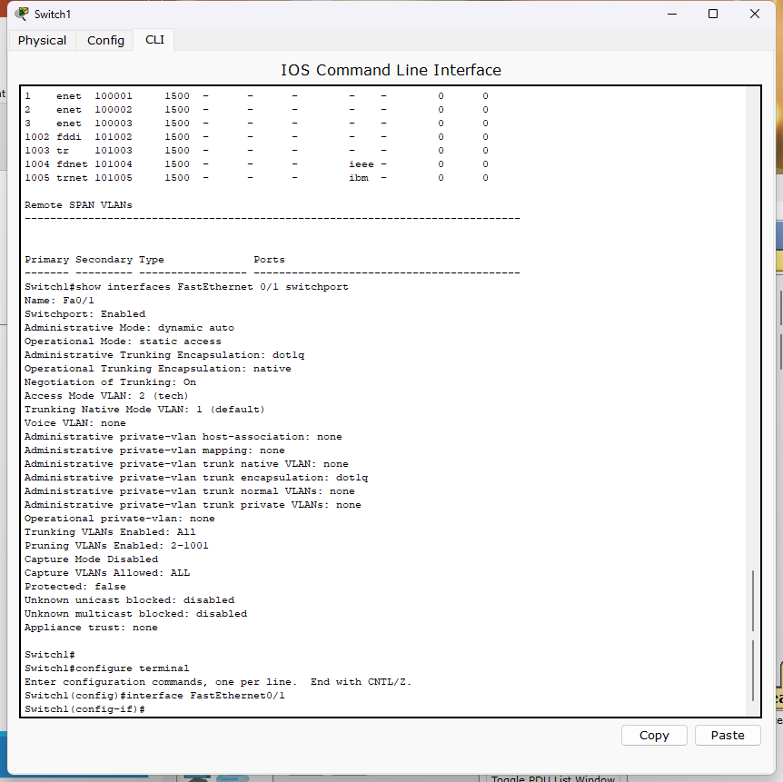

端口3：

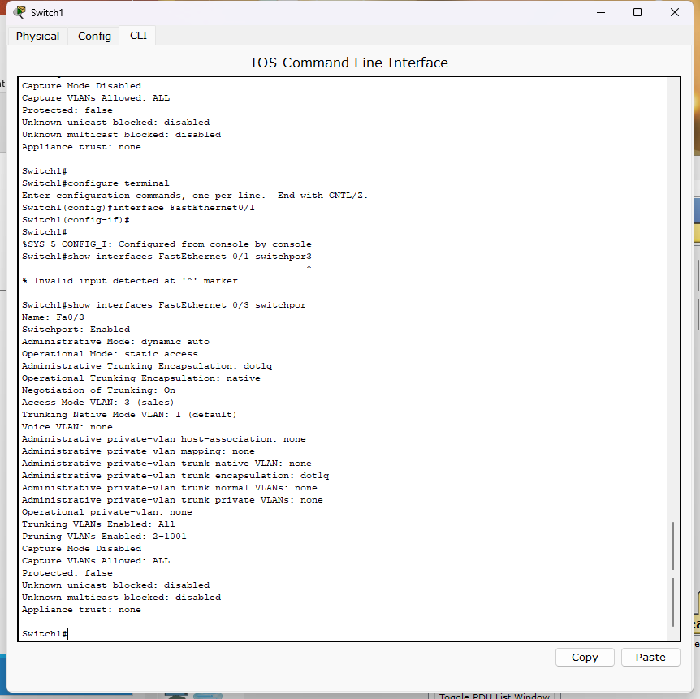

端口18：

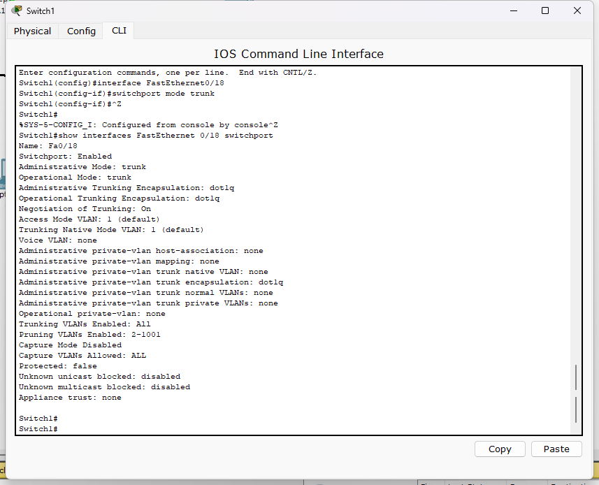

##### switch2:

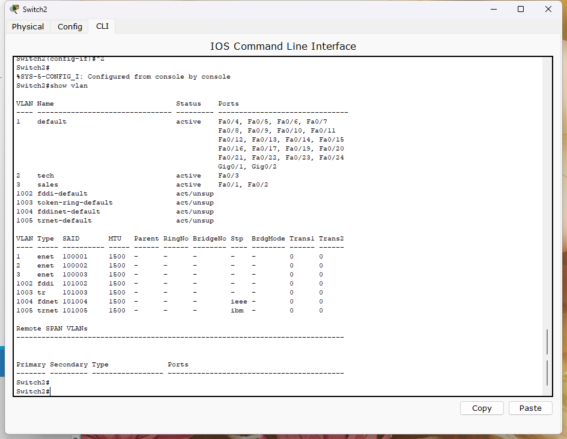

端口1：

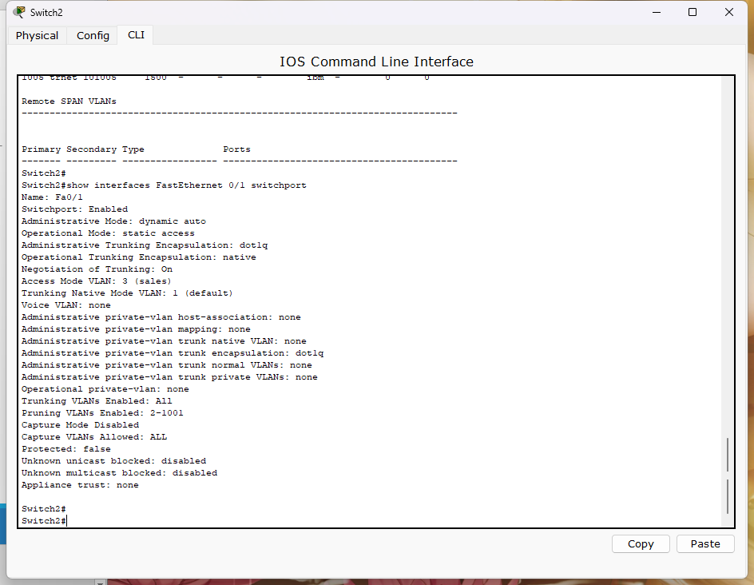

端口3：

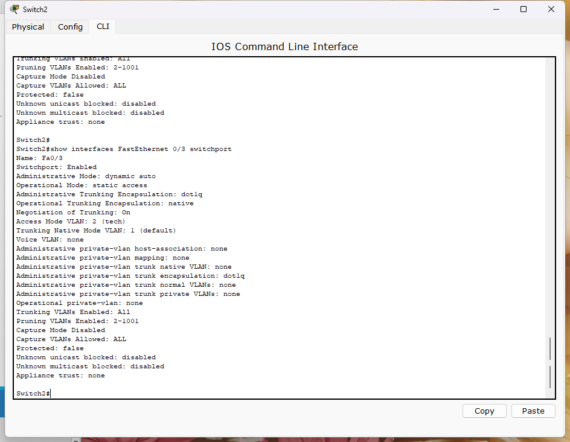

端口18：

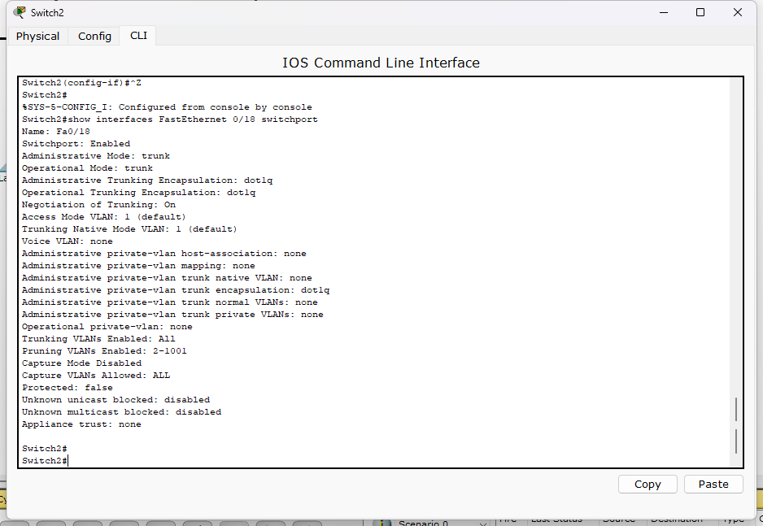

#### MAC-table:

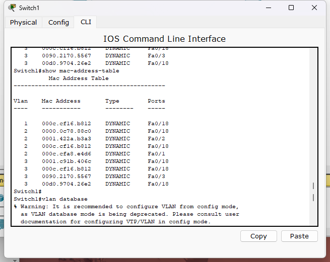

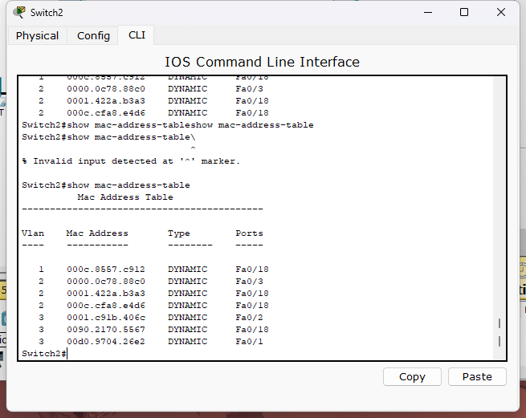

#### ping结果：

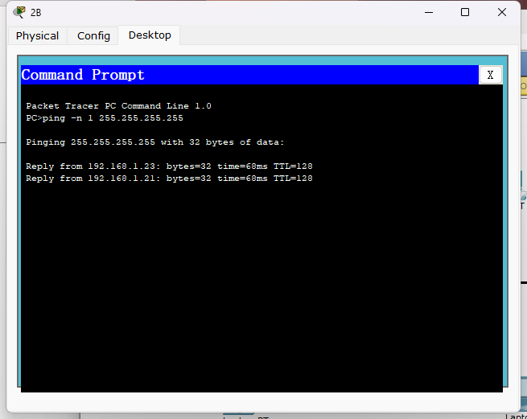

在2B上只能收到来自1B,3B的reply,原因为1b,2b,3b同属一个vlan，而交换机对广播指令，只会在源主机所在广播域中广播。

### Simulation

#### 广播包处理过程：

##### 第一次：

指交换机尚未学习到各种mac地址的情况。在3B中使用命令`ping -n 1 255.255.255.255`可以看到如下event list。

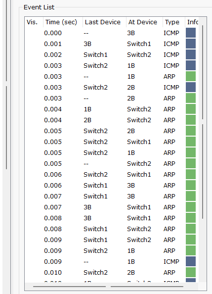

广播包处理流程为：

1. 3b广播ICMP报文

2. 1B，2B收到该icmp报文，需要回复报文，此时需要3b的mac地址，所以1b，2b各发出arp请求报文

   1. 以1b为例，报文至switch2时被广播到switch1和2b,2b拒绝该报文

   2. 该报文一直发送到3b，3b发送arp响应报文
3. 1b,2b发送icmp回复报文，该报文经switch2，switch1到达3b,结束

##### 第二次：

在3B中使用命令`ping -n 1 255.255.255.255`可以看到如下event list。由于此前已经ping过，不再需要发送ARP报文。所以报文顺序为：3b-switch1-switch2-1b and 2b - switch2 -switch1-3b

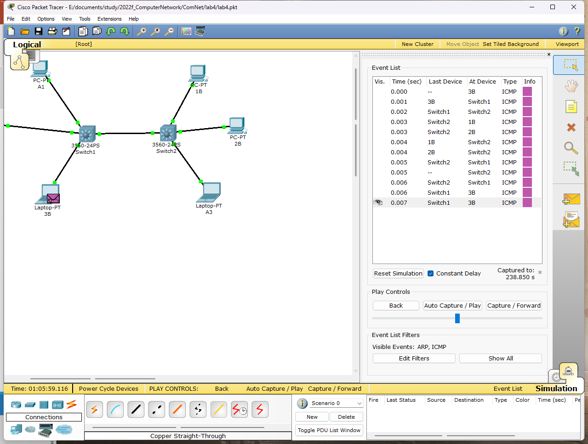

#### 802.1Q帧

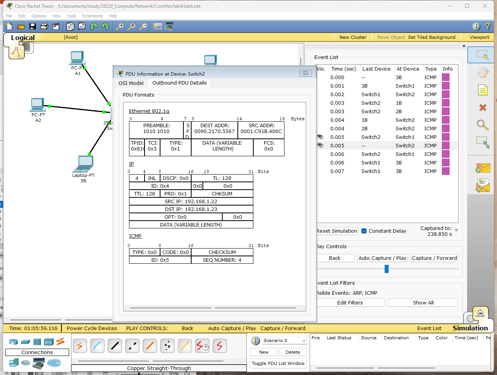

TPID=0x8100 TCI:0x3

TPID表示数据帧类型，取值为0x8100时表示IEEE 802.1Q的VLAN数据帧。如果不支持802.1Q的设备收到这样的帧，会将其丢弃。

TCI字段中包含3+1+12bit消息，分别对应PRI，CFI，VID字段，在此处Pri即优先级取值为0，CFI取值为0表示mac地址以标准格式经行封装，VID标识vlan编号，它们属于vlan3所以VID=3，综合起来TCI字段为3

### DTP:

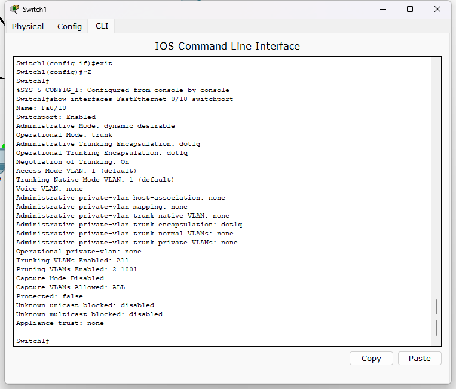

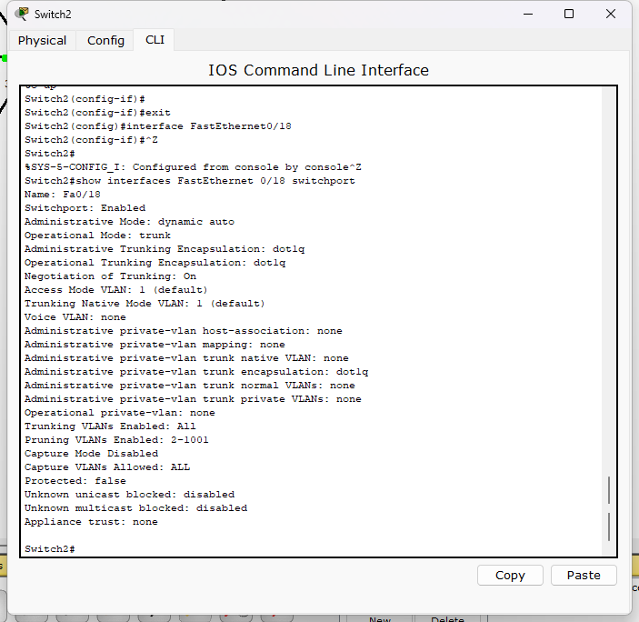

#### Negotiate：

五个模式区别如下：

1. trunk.
    手工静态配置为Trunk，并且还会向对方主动发起DTP信息，要求对方也工作在Trunk模式，无论对方邻居在什么模式，自己永远工作在Trunk模式。

2. Desirable
    此模式为DTP主动模式，工作在此模式的接口会主动向对方发起DTP信息，要求对方也工作在Trunk模式，如果对方回复同意工作在Trunk模式，则工作在Trunk模式，如果没有DTP回复，则工作在access模式。

3. Auto
    此模式为DTP被动模式，工作在此模式的接口不会主动发起DTP信息，只会等待对方主动发起DTP信息，如果收到对方的DTP信息要求工作在Trunk模式，则自己回复对方同意工作在Trunk模式，最后的模式为Trunk，如果DTP被动模式收不到DTP要求工作在Trunk的信息，则工作在access模式。

4. nonegotiate
    停止DTP协商，就是禁止协商模式，端口只允许处于一种状态要么是access，要么是trunk
    换句话说，如果一端端口启用了不协商模式为trunk 另外一端为自适应 那么就不能通信了。

5. access
    为Access模式，用来连接用户电脑的一种模式，只用于接入链路。例如：当一个端口属于vlan 10时，那么带着vlan 10的数据帧会被发送到交换机这个端口上。

停止协商后，即禁止DTP信息发送。只有双方都主动设置为trunk才可以运行

**表格中1表示可以，0表示不可以**

均为negotiate

| 1\2       | trunk | desirable | auto |
| --------- | ----- | --------- | ---- |
| trunk     | 1     | 1         | 1    |
| desirable | 1     | 1         | 1    |
| auto      | 1     | 1         | 0    |

只有双方都是auto模式，被动接受DTP信息，才无法建立trunk

1为no negotiate模式：

此时1仅能设置为trunk 和access模式，1不再能发出DTP信息，只有均设置为trunk才能trunk。

| 1\2    | trunk | desirable | auto |
| ------ | ----- | --------- | ---- |
| trunk  | 1     | 0         | 0    |
| access | 0     | 0         | 0    |