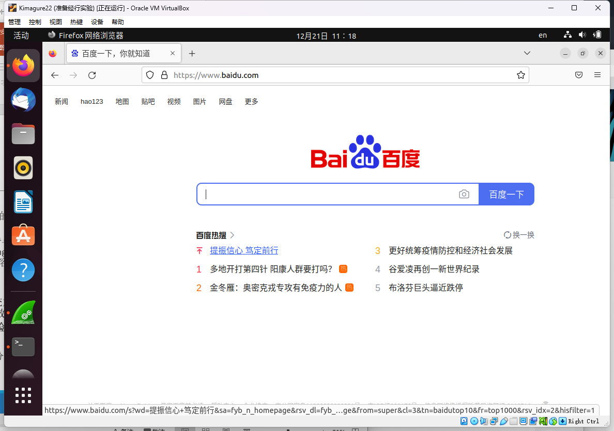
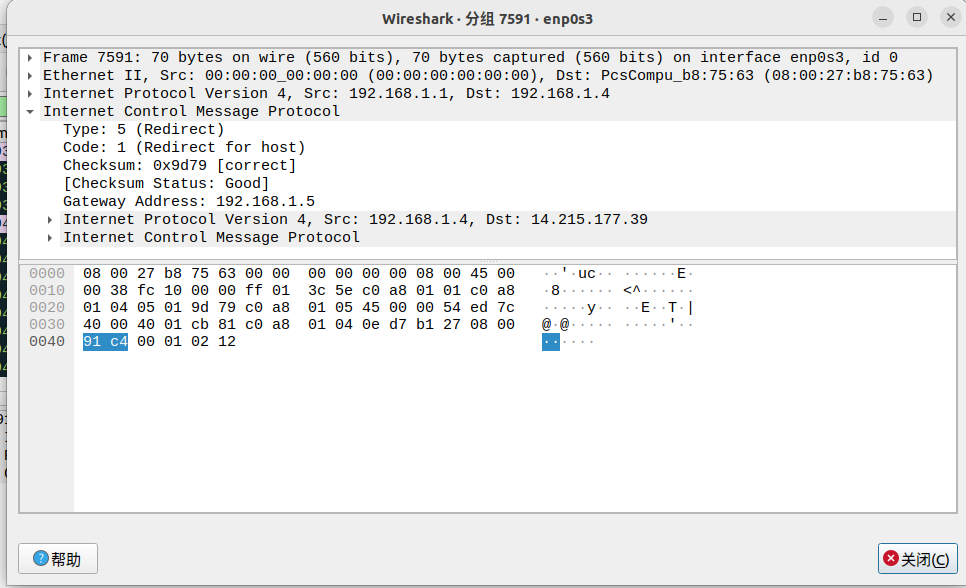

## 局域网安全实验 实验报告

赵子毅 PB20051107

### 实验场景

| 主机名               | ip地址      |
| -------------------- | ----------- |
| Windows11 22H2专业版 | 192.168.1.2 |
| Ubuntu22.04LTS       | 192.168.1.4 |
| Kali2022.04          | 192.168.1.5 |
| 网关                 | 192.168.1.1 |

### 网络拓扑图：


### ICMP重定向攻击：

初始状态：

可以正常访问网络




攻击后状态：

在kali上使用`sudo netwox 86 -f "host 192.168.1.4" -g "192.168.1.5" -i "192.168.1.1"`进行攻击


攻击抓包：




### ARP攻击：

攻击后效果：


ARP表：

攻击前：


攻击后：


可见成功欺骗被攻击机的arp表，将其arp表中网关硬件地址更改

攻击抓包：


### 选做部分：

#### ICMP防御：

直接禁止icmp重定向报文即可，手段为：

```shell
su root
gedit /etc/sysctl.conf
# 在上述配置文件中添加
net.ipv4.conf.enp0s3.accept_redirects = 0 #enp0s3为网卡名称
net.ipv4.conf.all.accept_redirects = 0
net.ipv4.conf.default.accept_redirects = 0
sysctl -p
```

防御结果：


虽然接收到了重定向报文，但是仍能正常ping通百度，说明系统并不会处理该重定向报文。

#### ARP防御：

```
$ sudo arp -s 192.168.1.1 8c:14:b4:50:a9:60
```

使用上述命令，将网关ip与其地址静态绑定，不可更改，从而拒绝伪装成网关的虚假arp报文

效果：


可见，即便kali攻击机一直在攻击，受攻击机中的arp表也不会受影响，自然也可以上网通信。